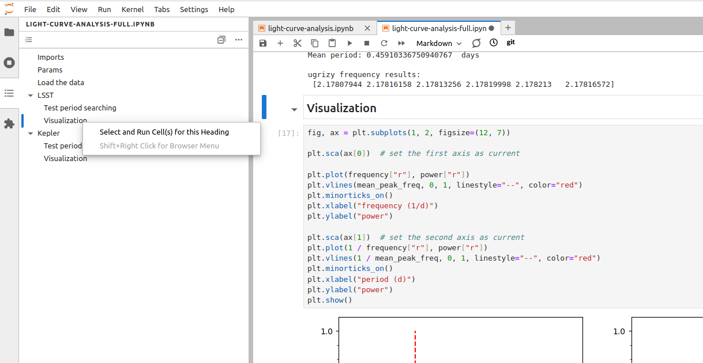
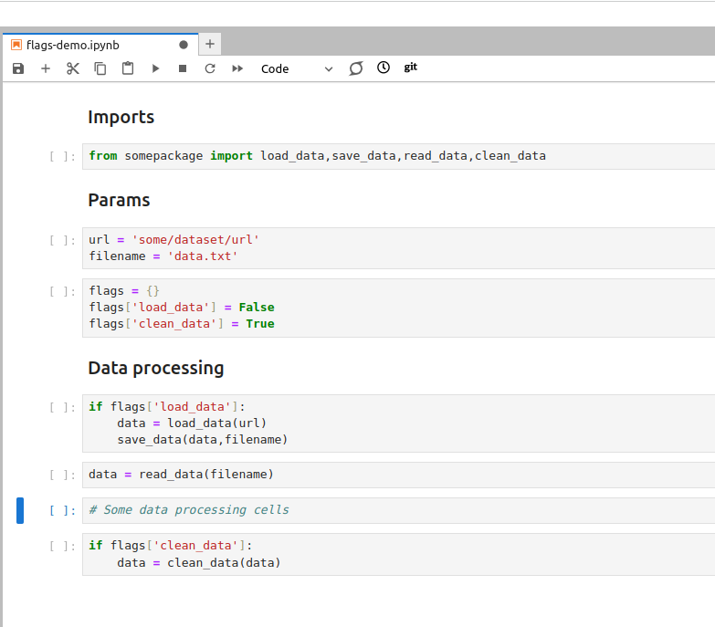
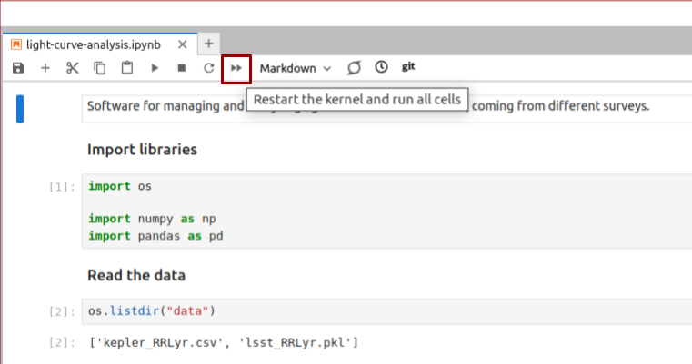

## Pros and Cons of Interactivity
Jupyter notebooks are very convenient since they allow executing pieces of code
in an arbitrary order, giving the developer a high level of interactivity. 
The other side of the coin is that notebooks enable the development of the code
without a clear structure, and that the result of the executed code differs depending
on which cells were executed prior to that. Taking care of keeping the code in order
falls on the developer's shoulders even more than when a classic IDE is used.

{: .image-with-shadow width="500px" }

Inattention to cell execution order can mess your data

As a result, Jupyter Lab is not recommended for large-scale software development, 
and even for smaller projects the final code should always be extracted into executable
'.py' files and converted into Python package. At the same time, notebooks are well-suited for 
data inverstigation, visualization and presentations, and it is the best when `.ipynb` files
contain only the code related to those tasks. Even then, without following certain 
best practices, notebooks have poor reproducibility. 

## Jupyter Lab best practices

Fortunately, Jupyter Lab provides us with a number of tools that allow us
to keep the notebook files clean, and the developed code reliable. Let's consider
the most important rules of keeping your notebooks in a good condition:

1. **Set the objective**. Define the objective of the notebook from the start and write it on the top of the notebook. Pay attention
   to how you phrase the objective: it should explain what is done in this notebook and be specific. E.g. instead of generic 
   'Some code for analysing the data' it is better to write 'Inspect, clean from NaNs and visualize on a histogram LSST RR Lyrae
   light curves dataset'.
2. **One notebook - one task**. One notebook should correspond to only one task or stage of your investigation.
   E.g. it is better to separate data preprocessing and visualization, or analysis of the spectra
   and analysis of the light curves. Do not stray from this objective; you definitely will get new ideas while working on your analysis,
   but if they are outside of the scope of this particular notebook, they should be extracted to a new file.
   There are two possible exceptions to this rule: if your notebook
   is really small (e.g. you just need to make a couple of plots), or if it's a 
   demonstration or presentation notebook.
3. **Structure first**.Think about the structure of the notebook before you start working, and write the headers of the sections
   in advance. For most astronomical projects, you will need at least four sections: imports, loading the data,
   pre-processing the data and analysis itself. Remember, that you can create subsections using secondary headers!
   It is also a good idea to put variables, that later will be used across the code (e.g. sizes of samples, time ranges for
   period search, magnitude limits) into a separate section before the analysis, and create temporary sections for classes and functions
   (which ultimately should be extracted into `.py` files).
4. **Utilize Markdown cells** for detailed explanations of what is done in the following code cells. Markdown cells
   allow you to use headers, common types of text formatting, such as bold, italics and strikethrough formatting,
   create lists, separators and tables, insert latex equations and use HTML formatting and so on. Here is a 
   [cheat sheet](https://www.kaggle.com/code/cuecacuela/the-ultimate-markdown-cheat-sheet) for the 
   common types of formatting. To convert the cell into Markdown, you can press `Esc` and then `M`, or 
   by using the drop-down menu in the instrumental panel at the top of the notebook tab.
5. **Keep it short**. Keep your notebooks short. There is no hard rule, but constraining a notebook to a hundred of cells is 
   a good idea. If your notebook is longer than that, make sure that you follow the rule of 'One notebook - one task'.
6. **Keep an eye on performance**. If your notebook contains pieces of code that are computationally
    expensive, work on a small representative sample of the data instead. When the code is ready, convert it into 
    an executable `.py` file and launch it from terminal. It will help you
    to avoid situations when the result of a long computation is lost due to the IDE crash, and also it will make it possible
    to launch your analysis on the machines where Jupyter Lab is not available, e.g. on a remote server.

> ## Jupyter Lab Table of Contents
> The benefit of using multi-level headers for sections and subsections is that Jupyter Lab uses them for creating
> the Table of Contents, which can be accesses from the collapsible left side-bar. With this panel, you can quickly evaluate the
> structure of your notebook, go to any subsection or execute all the cells under the selected header.
> {: .image-with-shadow width="700px" }
> 
Using the Table of Contents to execute cells in a selected section

{: .callout}
> ## Fix the structure of the 'light-curve-analysis.ipynb' notebook
> Go through the best practices listed above one by one and improve the structure of the `light-curve-analysis.ipynb`
> notebook.
> > ## Solution
> > Let's go through the recommendations one by one.
> > 1. **Set the objective**. Right now the objective of the notebook is phrased in a generic way. We can rephrase it into, e.g.
> >    'Inspect the sizes and visualize light curves from the LSST and Kepler RR Lyrae datasets.'
> > 2. **One notebook - one task**. Since for now our notebook is small, we can leave it as it is. However, potentially we could
> >    have put visualization into a separate notebook.
> > 3. **Structure first**. Currently the structure of the notebook is not well-defined. Add headers for the sections dedicated to the
> >    inspection of the datasets and visialization of a light curve, put all imports into the corresponding section and move the variables
> >    that we are likely to use in different sections to the 'Params' section
> >    (in our case it can be `plot_filter_labels`, `plot_filter_colors` and `plot_filter_symbols`). 
> > 4. **Keep it short**. Since our notebook has less than a hundred cells, for now we don't have this problem.
> > 5. **Utilize Markdown cells**. Give a brief description for each section (you can put it in the same cell as the headers).
> >    Use some formatting, e.g. in the 'Dataset inspection' section create a table listing the number of objects in current versions of
> >    each of the datasets.
> {: .solution}
{: .challenge}

> ## What about the code that has to be executed only once, and then skipped?
> Let's say you have some code that has to be executed only once, and in the next executions of the notebook
> it has to be skipped. Such situations often arise during data pre-processing, when some data has to be downloaded
> or cleaned from NaNs only once, and in the subsequent executions of the notebook loaded from the saved copy.
> Taking these pieces of code into a separate notebook is not always convenient, and using comments to make this code inactive
> makes your notebook hard to understand in the future. A good way to handle such situations is
> to use boolean flags to indicate which steps have to be executed, and which
> should be skipped. By storing these flags in the 'Parameters' section you can quickly see the current state of your work,
> and turn on and off different steps of the data processing as needed.
> {: .image-with-shadow width="700px" }
> 
Using boolean flags to indicate parts of the code that has to be skipped

{: .callout}    
   
7. **Reuse your code wisely**. The code that you use more than once has to be turned into functions.
   This recommendation is applicable in all situations, not only when you use notebooks.
8. **Package your code**. It is convenient to use Jupyter Lab for developing your code, however, once it is
   ready and tested, you should extract your classes and functions into `.py` files and then turn it into a
   Python package. This allows you to use this code again across multiple notebooks, in other IDEs
   or from command line. In the next few days we will talk more about how to package your code.
9. **Use 'Restart and Run All' often**. Executing cells out of order is one of the main source of errors when developing code
   in Jupyter Lab. For this reason, make a habit of regularly using the 'Restart and Run All' button, that will restart your kernel,
   delete all stored variables and execute all cells in the top-down order. Always do it before
   saving the notebook and pushing it into a Git repository. This habit greatly improves the reproducibility of your notebooks.

> {: .image-with-shadow width="500px" }
> 
'Restart and Run All' button helps you to ensure that your notebook is executed in the right order

> ## Shouldn't We Clear Outputs of All Cells Before Pushing the Notebook into a Repo?
> There is an old recommendation to always use `Restart Kernel and Clear Outputs of All Cells`
> before committing the notebook into a Git repository. This recommendation comes from the fact that
> native Git tools for comparing different versions of the files (`git diff`) do not handle `.ipynb` files well.
> Plots in the outputs cause especially inconvenient.
> However, `git diff` in general isn't suitable for investigating changes in any files that are not, in essence, plain
> text. More so, clearing the outputs of the notebooks after you finished your work makes it impossible to e.g.
> use the notebook for a spontaneous presentation or demonstration of the results. The solution to this problem is
> to use the suitable instruments. Jupyter Lab has several extensions that allow to compare different versions
> of the notebooks, such as [`nbdime`](https://nbdime.readthedocs.io/en/latest/) and [`jupyterlab-git`](https://github.com/jupyterlab/jupyterlab-git).
> More so, currently GitHub provides us with a possibility to use so called 'Rich Jupyter Notebook Diffs' when an updated notebook
> is pushed in your repository. You can enable this function by clicking on your avatar in the top right corner and then selecting
> `Feature Preview > Rich Jupyter Notebook Diffs`.
{: .callout}

> ## Jupyter Notebook, Rubin Science Platform and Google Colab
> While RSP and Google Colab have Jupyter Notebook installed and not Jupyter Lab, all of the
> best practices above are still applicable on these platworms, with the only exception that
> you will have to create the Table of Contents manually.
{: .callout}

> ## Additional exercise
> Open one of your recent notebooks and apply the best practices listed above to improve its structure.
> Do you need to reorder your code a lot? Is there some code that can be extracted into `.py` files?
{: .challenge}


