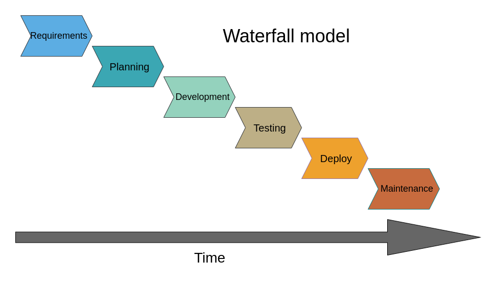
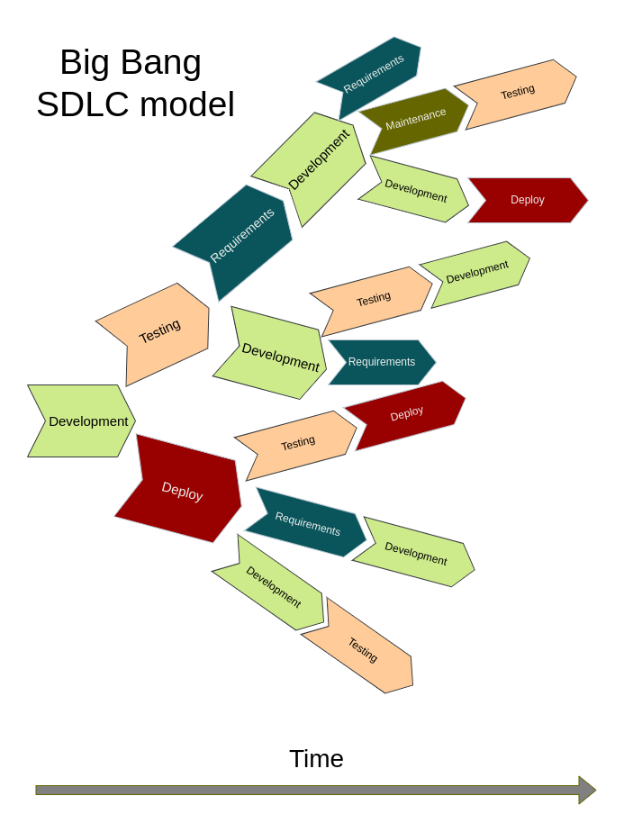

Up until now we treated our project as a collection of functional elements. We looked through it 
line by line to fix style errors and coding conventions, then we looked at separate functions to 
write unit tests, and then we analyzed its functions to find out how we can rewrite the code using OOP (Object Oriented Programming). 
However, designing software that will be both useful and maintainable over the long term 
means more than writing code that can perform certain tasks. There are a number 
of factors that we need to take into account, such as how fast the code needs to work, what kind of computational 
resources it will need, how easy it will be to add new functionality, how convenient it will be to the end user and so on. 

It is not a trivial task to think about all these factors while writing the code, even for a small project, and it can 
be a great deal of work to add functionality retroactively if a piece of software is poorly designed. So it is much more 
reasonable to think about them in advance. The idea of separating the planning stage from the implementation stage led to 
the appearance of the concept of Software Development Life Cycle.

## Software Development Life Cycle (SLDC)

Software Development Life Cycle (SLDC) is a methodology that splits the process of software development into a number of stages (usually between four and six):  

- Requirements gathering and analysis: determining what functionality the stakeholders want.
 For large projects this stage includes user surveys and domain analysis (What functionality 
is already provided by pre-existing, similar projects? What are the unsolved problems of the potential users?).
 For a small project this step may be as short as writing down a list of desired features;
- Planning: determining what resources are needed to fulfill the requirements and deciding how
 the work process is going to be organized. For large projects it may include decisions to hire more
 people for the development team or obtaining more CPUs/GPUs for the cluster. For a small project it
 may be as short as deciding which Python libraries will be used;
- Software design: outlining software architecture. At this stage, the detailed description of how the
 software will be designed is produced, shared with the stakeholders and edited in accordance with the feedback;
- Development/Implementation: writing the code;
- Testing. This phase includes not only unit testing (which is normally done during the development
 stage, especially if Test-Driven Development is used), but also integration testing, performance testing, 
beta testing (manual) and so on;
- Deployment: installing the software in the operating environment (which can be very different from the
 development environment), familiarizing the end users with the software;
- Maintenance.

Each stage of SDLC is a separate discipline with its own practices, standards and documentation. Small teams, typical in science, often don’t have the resources to utilize these standards and methodologies. However, even a single-developer ‘team’ can benefit from using a simplified form of SLDC. 

## Life Cycle Models

Depending on the project, going through the SDLC stages only once and in sequential order is usually not the best idea. What if it becomes clear that you need additional functions after you implemented the first set of features, or if you need to adapt the software for a new operational environment - let's say, migrate it into a cloud?
{: .image-with-shadow width="500px"}

For such situations, different SDLC models exist. The sequential one, when all the stages follow one another only once, is called the Waterfall model, however, nowadays it’s not very common. The way software development is often done in academia, with little to no requirements analysis and planning before the development itself, is called the Big Bang model. While acceptable for short small-scale projects (or prototypes), sticking to this paradigm after the project exceeds a couple of hundred lines of code leads to chaos, computational ineffectiveness and poor maintainability. 

{: .image-with-shadow width="500px"}

## What Comes After the Big Bang (Model)

In industry, one of the most popular SDLCs is Agile. This approach assumes that all stages of the life cycle are performed in iterations, or time-limited sprints (usually 1-4 weeks), with each sprint having a well-defined and relatively small goal (such as implementation of a single feature). This methodology aims to be flexible enough to incorporate requirements as they appear, and at the same time strict enough to not skip the requirements analysis altogether. 

{: .image-with-shadow width="500px"}

Let's assume that you started writing the LCAnalyzer as a small script for a quick data exploration, 
but now new collaborators join your project, and they will need some additional functionality. 
In this situation we can treat our code as a prototype, developed following the Big Bang SDLC model, 
and we want to continue in a more organized fashion, using Agile-like approach. The first step is to gather requirements.

> ## Prototype is for throwing it away
>
> In case when the requirements aren’t clear from the beginning,
> starting with a prototype to figure them out is a perfectly valid choice.
> However, it is important to be ready to throw the prototype away and start
> again from scratch in case the discovered requirements and constraints reveal
> that originally chosen architecture is not the most suitable.
> It is hard to say at what point it’s time to switch from Big Bang-style prototyping
> to a more organized development methodology, but it’s a good idea to consider this
> after your code becomes larger than a hundred lines. The larger your prototype,
> the harder it is to admit that you have to put it aside and the longer it will take
> to create a new version with a different, more efficient architecture.
{: .callout}

### The first stage of SLDC: Requirements Gathering and Analysis

Software requirements are the answer to a question “what our software is supposed to do”. 
There is a hierarchy to them: they are usually separated into **Business**, **User/Stakeholder** and **Solution** Requirements.

Business requirements describe what is needed from the perspective of the organization, and define the strategic path of the project, e.g. to embark on a new research area or collaborative partnership. User/Stakeholder requirements define what particular stakeholder groups each expect from an eventual solution, essentially acting as a bridge between the higher-level business requirements and specific solution requirements. Finally, Solution (or product) requirements describe characteristics that software has to have in order to satisfy the stakeholder requirements.

The reasoning behind this hierarchy is that the answer to a question “what our software should do” will depend on who you ask. 
For example, a PI of a research group when writing a funding proposal will answer this question like this: 
- **BR 1:** The software must extract periods for all periodic sources in an LSST Data Release within 2 weeks after the release is public.
 
Starting the development with this requirement alone will end in a huge disappointment, since formally you can deliver a package that will produce a table with two columns, an object ID and a period estimation, and it won't be enough for a proper scientific analysis. At the same time, it is excellent for estimating the scope of the project: it states the main purpose of the software, what the input data will be and what are the computational constraints. Such a requirement can be considered as a business requirement.

A postdoc who's going to use this software will give a different answer, somewhere along the lines of: “the software must determine the periods with three period-finding algorithms, and it must be able to plot phased light curves and periodograms”. This kind of answer gives us something to work with: at the very least we understand that we need to implement:

- **UR 1.1:** The software must be able to determine periods with Lomb-Scargle, binned means and SuperSmooth period-finding algorithms.
- **UR 1.2:** The software must be able to plot a phase-folded light curve.
- **UR 1.3:** The software must be able to plot a periodogram.
  
Each of these items is a User requirement.

Still, if we start the development with those requirements, we’ll encounter a number of uncertainties. For example, what should we do if our light curves contain NaNs or outlying data points? And should the software be able to plot folded light curves for all the millions of periodic sources in the LSST Data Release?

Such questions are answered with the lowest-level, or solution, requirements, which are split in two categories. The first one, functional requirements, correspond to the smallest features of the software. E.g. the software must drop NaNs and outlying values.

- **SR 1.1.1:** The software must drop NaNs and outlying values before running period finding algorithms. 
- **SR 1.1.2:** The software must read light curves in .csv, .pkl, .dat formats.

The second category is called non-functional requirements, and they define how these features will be implemented. They constrain things like computational performance, security or usability. E.g. if the user asks to plot more than 10 light curves, they must be saved as .png on a drive instead. Or, thinking about the original business requirement, we should specify that the software must be able to analyze a million sources in under three days.

- **SR 1.1.1:** The software must be able to determine periods for a million sources in under 3 days.
- **SR 1.2.1:** The software must be able to display plots on screen or save them as .png.

{: .image-with-shadow width="300px"}

### Not all requirements will be implemented.

In a perfect world, we would be able to implement all the desired requirements by the time we go to lunch. In reality, we have limited resources, and quite often we have to make sacrifices or risk never finishing the work at all.

After the requirements are written down, it is time to look over them and decide how realistic they are, considering available time and people resources. For this we can use a MoSCoW methodology. MoSCoW is an acronym that stands for Must have, Should have, Could have, and Won't have, and each requirement, after a discussion with the stakeholders, falls into one of these four categories:

- **Must Have (MH)** - these requirements are critical to the current timebox for it to succeed. Even the inability to deliver just one of these would cause the project to be considered a failure.
- **Should Have (SH)** - these are important requirements but not necessary for delivery in the timebox. They may be as important as Must Haves, but there may be other ways to achieve them or perhaps they can be held back for a future development timebox.
- **Could Have (CH)** - these are desirable but not necessary, and each of these will be included in this timebox if it can be achieved.
- **Won't Have (WH)** - these are agreed to be out of scope for this timebox, perhaps because they are the least important or not critical for this phase of development.

It is also common to plan a sprint in such a way that MH/SH/CH categories took 60%/20%/20% of working time correspondingly. This approach helps to ensure that SH and CH requirements aren’t neglected, and at the same provides enough time cushion to redistribute it if needed.

> ## Collaborative work on requirements
>
> Split in pairs and go into breakout rooms. Create a common Google Document.
> Imagine that you are a PI writing a funding proposal. Think for a few minutes
> and write down in the document a Business Requirement and subsequent Stakeholder
> requirements for some kind of software that would be useful in your work.
> Then take each other’s Business Requirements and write down several Solution
> requirements for this future software. When it’s done, provide each other
> with feedback on whether you think the Solution requirements will be enough
> for developing the software you need. Don’t forget about non-functional requirements,
> and don’t forget that not all requirements are realistic! If the Business Requirement
> includes ‘do a differential imaging on the whole LSST image dataset for 10 years in
> under 10 hours’, this part of the requirement has to be crossed out.
> If you are going through this materials on your own and don’t have a learning
> partner, you can use a new business requirement for the LCAnalyzer:
> 
> **BR 2:** The software must perform periodic/non-periodic classification of all variable sources in the LSST Data Release.
> 
> > ## Solution
> > 
> > **User requirements:**
> > 
> > **UR 2.1:** The software must be able to calculate a reliability
> > score of the found periods for each of the period-finding algorithms.
> >
> > **UR 2.2:** The software must be able to calculate a probability that the source
> > is variable based on the reliability scores for the obtained periods and on
> > the closeness of the periods determined with different methods.
> >
> > **UR 2.3:** For the sources for which no algorithm produces a reliable period, the
> > software must run a transient event detection algorithm.
> > 
> >    **Solution requirements:**
> > 
> >    **Functional:**
> > 
> > **SR 2.1.1:** The software must calculate a reliability score of the 
> > period found by each of the implemented algorithms. The reliability score must vary from 0 to 1.
> > 
> > **SR 2.2.1:** The software must calculate two probability metrics relating to the variability of the source:
> > one calculated as a median reliability score for the determined periods, and another
> > as a mean deviation of the discovered periods.
> > 
> > **SR 2.3.1:** The software must run a transient event detection algorithm for the
> > sources for which no periods were determined, or for which the probability of
> > being variable is below a user-defined threshold.
> > 
> >    **Non-functional:**
> > 
> > **SR 2.3.2:** The software must run a transient event detection algorithms in under 1 second per source. 
> > 
> {: .solution}
> 
{: .challenge}

## From Requirements to Implementation, via Design

In practice, these different types of requirements are sometimes confused and conflated
when different classes of stakeholders are discussing them, which is understandable:
each group of stakeholders has a different view of *what is required* from a project.
The key is to understand the stakeholder's perspective as to
how their requirements should be classified and interpreted,
and for that to be made explicit.
A related misconception is that each of these types are simply
requirements specified at different levels of detail.
At each level, not only are the perspectives different,
but so are the nature of the objectives and the language used to describe them,
since they each reflect the perspective and language of their stakeholder group.

It's often tempting to go right ahead and implement requirements within existing software,
but this neglects a crucial step:
do these new requirements fit within our existing design,
or does our design need to be revisited?
It may not need any changes at all,
but if it doesn't fit logically our design will need a bigger rethink
so the new requirement can be implemented in a sensible way.
We'll look at this a bit later in this section,
but simply adding new code without considering
how the design and implementation need to change at a high level
can make our software increasingly messy and difficult to change in the future.


