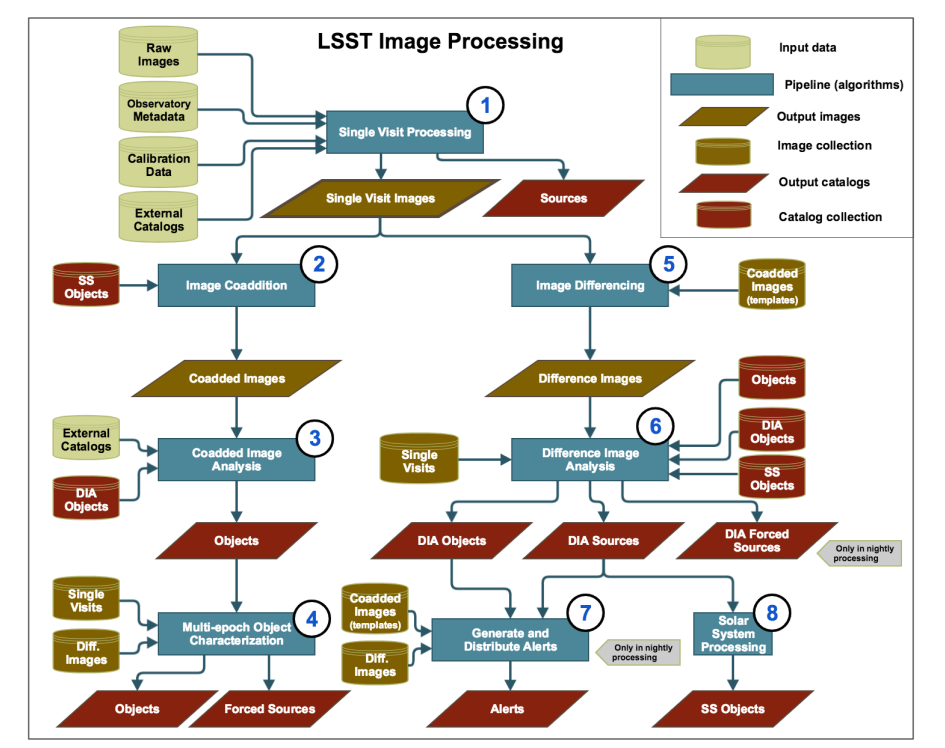
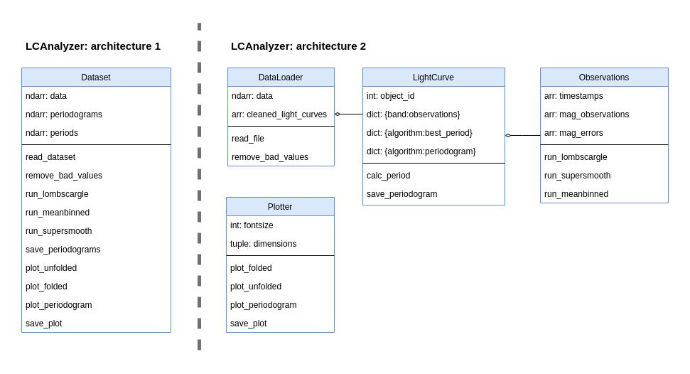

## Introduction

In this episode, we'll be looking at how we can design our software
to ensure it meets the requirements,
but also retains the other qualities of good software.
Software design, as opposed to software requirements, deals with **how** a project will be realized in
terms of data structures, algorithms and system architecture. Requirements, on the other hand,
specify **what** must be accomplished.

## What is software architecture?
As soon as we know _what_ our software is supposed to do, we have to find out how it will 
be doing what it’s doing. This is where **software architecture** comes into play.
Software engineering borrowed this term, and a few other terms,
from architects (of buildings) as many of the processes and techniques have some similarities.
One of the other important terms we borrowed is 'pattern',
such as in **design patterns** and **architecture patterns**.
This term is often attributed to the book
['A Pattern Language' by Christopher Alexander *et al.*](https://en.wikipedia.org/wiki/A_Pattern_Language)
published in 1977
and refers to a template solution to a problem commonly encountered when building a system.

Design patterns are relatively small-scale templates
which we can use to solve problems which affect a small part of our software.
One example is a strategy pattern that could handle multiple algorithms and handling them
in a consistent way. Architecture patterns are similar,
but larger scale templates which operate at the level of whole programs,
or collections or programs. Model-View-Controller 
is one of the best known architecture patterns. During the development process, 
programmers using the Python web framework Django will encounter it frequently.

Many patterns rely on concepts from Object Oriented Programming and 
there are many online sources of information about design and architecture patterns,
often giving concrete examples of cases where they may be useful.
One particularly good source is [Refactoring Guru](https://refactoring.guru/design-patterns).

To determine software architecture means to describe which components 
(modules, classes, functions, databases) are going to be implemented, 
what are the relations between them, and how they are going to interact 
with each other, with other software and with the user. 
Software architecture leads the design and implementation of the software.
To design the architecture of your software, several things have to be taken into account:

- **Flexibility.** What kind of additional functionality may be included in the future? 
What kind of architecture allows you to implement new features more easily?
- **Performance/Scalability.** What are the potential ‘bottlenecks’ of your software
(e.g. a computationally-expensive calculation, or the necessity to download
heavy observational data in real time)? Which architecture speeds 
up these slow parts of the software? (E.g. computationally-expensive 
calculations may be parallelized and performed on a cluster and its results 
sent back to your PC; instead of downloading large volumes of the data it may 
be possible to run the code where the data is stored, e.g. on Rubin Science Platform). 
If you develop software for multiple users, you need to consider if they’ll 
need simultaneous access to the same resources.
- **Portability.** Will this software be launched on other platforms, 
e.g. on an institute’s cluster or in a cloud?
- **Maintainability.** How simple is it going to be to test this software? 
Will its design be clear enough for other developers (e.g. your students) 
to troubleshoot it when needed? 
- **Security.** If your software uses proprietary data, how data access 
rights will be preserved? If you are developing a server-based software 
for multiple users, how are you going to develop authorization?
- **Integration with other software and user interfaces.** What kind of data your 
software may need from other applications? What kind of outputs your software will 
produce, and will it be easy to implement a new output format or user interface 
(e.g. to create an interactive plot or store the calculation results in JSON instead of DAT)? 

Similarly to the hierarchy of the requirements, the design process also has stages,
with the next stage outlining smaller details than the previous one. This is the so called
‘top-down’ approach. For the large project this approach is more common and more efficient than ‘bottom-up’.

Software design process can be split into following phases:
- **Component design.** At this stage, the general blueprint
of the software is created. Component design describes separate services, 
pipelines and modules, and then lists classes and stand-alone functions, 
together with a rough description on how they are going to interact with each other.
- **Data design.** At this stage it is determined which data structures will be used.
- **Interface design.** This stage is for determining public methods of the classes
and finding out how different components will interact with each other.
- **Procedural design.** Here specific algorithms within the components are determined.
  
## Software Design methods

There are several ways to go from the list of requirements to software architecture.

**The noun-in-text.** Write down a short description of the software, 
and then identify all nouns in the text. The  nouns related to the environment 
outside of the software are thrown away, and those that mean the same concept are 
‘merged’. The nouns that are related to the same concepts are grouped together, 
with one noun in the group being selected as the most representative of the group. 
This noun usually becomes a class, and the rest of the nouns in the group may become 
inherited classes or turn out to be good class attributes. This method is applicable even 
if you have only a general description of the software, so it’s suitable for working on 
a small project, and it’s especially helpful for the component design stage. 
It can also be applied to the user or solution requirements - or used for for writing them.

> ## Exercise: The noon-in-text practice
>
> Let’s say that we are starting a new project: we want to develop a package that detects
> faint structures on the galaxy images. We want the software to be able to read images in
> different formats and produces a list of detected structures. For each detected structure,
> the package should produce a corresponding image file that would indicate which pixels
> belong to the detected faint structure.
>
> Using this description of software, apply noun-in-text approach to identify the main components
> of the software and decide which of the nouns will be classes, which will become attributes and which will be discarded.
> Think on the uncertainties that arise in the process and on the different possible architectures for this case.
> 
> > ## Solution
> >
> > The list of nouns will look like this:
> > _faint structures, galaxy, image, format, list of detected structures,
> > detected structure, corresponding image file, pixel belonging to the structure_
> >
> > Without knowing anything about astronomy, we can presume that our software will have:
> > 
> >- class `Image` with attributes `str: format` and `Galaxy: galaxy`;
> >- class `Galaxy` with attribute `list: detected_structures`;
> >- and class `FaintStructure` with attribute `image: belonging_pixels`.
> > 
> > However, after some consideration it becomes apparent that there is a number of uncertainties.
> > Does an image always contain one and only one galaxy,
> > or there may be several galaxies in the image? Does the user pass the list of detected galaxies pictured in the
> > image before launching faint structure detection, or do we need galaxy detection feature within the package as well?
> > What are the properties of a detected galaxy - is it defined only by its center coordinates or it has a mask indicating
> > which pixels belong to which galaxy? Is it possible for a faint structure to be detected without a host galaxy?
> >
> > Answering these questions leads to new User and Solution requirements and will affect the design of the software.
> {: .solution}
> 
{: .challenge}

**Use case scenarios.** Imagine a potential user of your software, then identify what will be the 
goal of this user, when running your software, and then write down the steps that the user will need to 
take in order to reach this goal. This method works well for the interface design stage, however, it is useful for component and data design too.

**Using diagrams.** There are various types of those; we will consider only two: system and class diagrams.

### System diagram

System diagram is an overarching visualization of the major components of the system. 
It can demonstrate the data flow and use case scenarios, as well as connections to external resources. 
Creating such a diagram is useful for larger projects. Below a system diagram taken from 
the LSST [Data Product Definition Document](https://docushare.lsst.org/docushare/dsweb/Get/LSE-163) illustrates the conceptual design
of the LSST pipelines for processing images.

{: .image-with-shadow width="600px"}

  System diagram of the conceptual design of LSST science pipelines for imaging processing. 
Without imposing any constraints on the implementation of the science pipelines, 
  this diagram outlines that there will be eight major and largely 
independent pipelines, and gives information about which connections to the external 
databases are needed and which output catalogs will be produced at each stage.

### Class diagram

For a more detailed design description, we can use a class diagram. It depictures classes 
together with their attributes, methods and relationships (such as composition or inheritance) 
using a set of conventions called Unified Modeling Language, or [UML](https://en.wikipedia.org/wiki/Unified_Modeling_Language). 

{: .image-with-shadow width="800px"}

An example of object model diagrams of two possible implementations of the LCAnalyzer. 
These implementations have the same functionality, but different architectures. 
The first example has a single class ‘Dataset’, and its methods (listed in the bottom part of the box;
the middle section contains class attributes) perform everything from 
reading the files to plotting periodograms. It doesn’t create a separate object ‘LightCurve’, 
but instead stores the data as a table (‘ndarray: data’). Extracting the necessary observational 
datapoints from the records of this table will be the responsibility of every function that will 
use them. This architecture is likely to produce a lot of duplicated code and will make adding new 
functionality difficult, however, it can be computationally effective, if many of the functions 
can be vectorised (effectively applied to a numeric array in which our light curves are stored).

In the second architecture, we separate functionality related to the dataset as a whole from the 
features related to the light curves processing. Even more, every LightCurve object has 
a dictionary where observations in different bands are stored, with Observations being another 
class. Plotting functions are also put in a separate class and completely independent (there is no connector joining this class with the
others), which 
means that we can use them even without having a DataLoader or LightCurve instance. This 
architecture is better in terms of separation of concerns, more convenient to test and more flexible. 

> ## Exercise: Developing class diagram for the Faint Structure Detection software
>
> In this exercise you will use an online diagram drawing tool to create a class diagram for the faint structure
> detecting software from the previous exercise. Using [this link](https://drive.google.com/file/d/1Q_VySs4baVcmtWCHnCfa9ILvuuBindpE/view?usp=sharing),
> you can open a file with pre-defined
> blocks and turn them into a class diagram (the link opens a file on the Google Drive; in the drop-down menu
> on top of the window choose 'Open with draw.io'). Feel free to move and create additional classes, attributes and methods
> as you see needed, and think how this architecture would work in practice. Some of the methods and attributes are intentionally
> placed into the wrong classes!
> 
> After doing that, let's imagine that you realised that you have a new requirement for your software:
> The user should be able to manually draw a mask (to exclude bright stars, artefacts and so on)
> that will be applied before the stream detection. 
> Look at your class diagram. Modify it to add the new feature. Do you encounter any difficulties?
> Did you have to rework a large part of the architecture to satisfy this new requirement?
> 
> > ## Solution
> > One of the possible solutions is pictured below. Here we have three offered classes and one new class
> > for plotting and drawing functions. Considering that classes
> > "Galaxy" and "FaintStructure" are pretty similar up until now, we could also go with creating a parent class 'Structure'
> > for which "Galaxy" and "FaintStructure" would be child classes.
> > {: .image-with-shadow width="300px" }
> {: .solution}
>
> There are multiple tools for drawing diagrams. You can use any of them, including diagram blocks in Google Docs
> or any other office application. And unless you need to prepare
> a public software documentation, you can even draw them by hand, if that's more convenient.
> Time: 10 minutes
{: .challenge}

## Software Requirements Document and Software Design Document

As was mentioned in the previous episode, each life cycle stage has its own best practices,
specifications and formats. Two common types of specifications are 
Software Requirements Document (SRD) and Software Design Document (SDD):

- SRD focuses on 'what' the system does, describing its main purpose, potential users, their needs and expectations (often in
the form of use case scenarios),
the system's necessary and desireable features. As the name suggests, it also includes full list of the requirements;
- SDD addresses how the system does it, including the architectural design, detailed components and data structures,
diagrams, pseudocode, interface layouts, etc.

There are multiple templates of these types of documentation. The LSST Transient and Variable Sky Science Collaboration 
has its own astronomy-adapted SRD and SDD templates, written based on the [IEEE recommendations](https://ieeexplore.ieee.org/document/278253) 
and available for everyone. Hovewer, for a small-scale project it is acceptable to go with
a simplified version of these documents, that boils down to a checklist:

**SRD checklist**:

1. Introduction
- [ ] Purpose & Scope
- [ ] Audience/Stakeholders 
- [ ] Problems within the scope of the software
- [ ] References, definitions, acronyms
2. Overall Description
- [ ] Context (self-contained, part of larger family)
- [ ] Major functions as bullet points
- [ ] User classes and characteristics
- [ ] Where will the software be operated?
3. Interface Requirements
- [ ] User interfaces
- [ ] Software and hardware interfaces
- [ ] Communication interfaces/protocols 
4. System Features
- [ ] Description and Priority
- [ ] Stimulus/Response (use case scenarios)
- [ ] Functional Requirements
5. Nonfunctional Requirements
- [ ] Performance Requirements
- [ ] Security Requirements

**SDD checklist:**

1. Software Overview
- [ ] Architecture Description
- [ ] Data flow diagram
- [ ] Dependencies
2. Development Process
- [ ] Hardware design decisions
- [ ] Technology stack
- [ ] Coding standards & testing strategy
- [ ] Security & Backup
- [ ] Roadmap (work plan, timeline estimation)
- [ ] Possible future functionality
3. Detailed description
- [ ] Components and their relationship
- [ ] Data Model
- [ ] Interface design (front-end, jupyter, API)
- [ ] Procedural design, e.g. diagram, pseudo-code

## At what stage it's time to start using these techniques?

Aspirationally, what makes good code can be summarised in the following quote from the
[Intent HG blog](https://intenthq.com/blog/it-audience/what-is-good-code-a-scientific-definition/):

> *“Good code is written so that is readable, understandable,
> covered by automated tests, not overcomplicated
> and does well what is intended to do.”*

By taking time to design our software to be easily modifiable and extensible,
we can save ourselves a lot of time later when requirements change.
The sooner we do this the better -
ideally we should have at least a rough design sketched out for our software
before we write a single line of code.
This design should be based around the structure of the problem we're trying to solve:
what are the concepts we need to represent
and what are the relationships between them.
And importantly, who will be using our software and how will they interact with it?

How much effort should we spend on designing our code properly
and using good development practices?
The following [XKCD comic](https://xkcd.com/844/) summarises this tension:

{: .image-with-shadow width="400px" }

There are a wealth of practices that could be used, 
and this abundance can be intimidating. It is tempting
to skip the requirements analysis, planning and design stages and just go on with the
Big Bang SDLC model. However, picking one or two software design 
approaches and using them at the beginning of _every_ software project, even a small one,
is what separates an *intermediate developer* from someone who has just started coding.
It is much better to have a few use case scenarios written in a `.txt` file and a photo
of a class diagram drawn on a napkin from a cafeteria than to have an empty 
fancy template of a Software Design Document and a thousand lines of spagetti-code
written with no preliminary architecture in mind. Make it a habit to spend
at least ten minutes writing down the requirements and software architecture 
every time you open your IDE, and it will save you months of work in the future.


