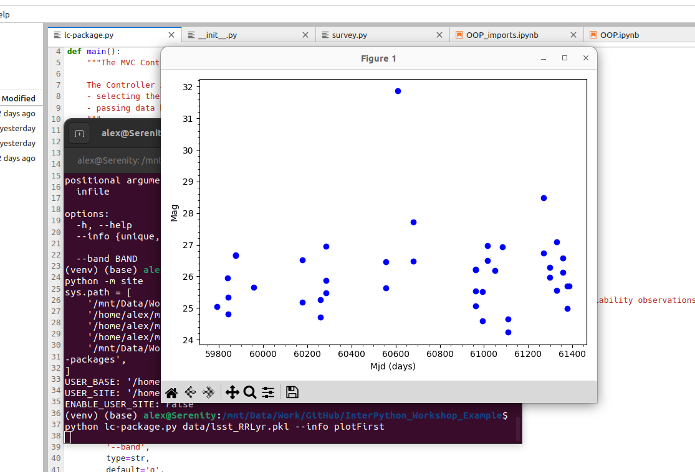

As we have seen, we have different programming paradigms that are suitable for different problems
and affect the structure of our code.
In programming languages that support multiple paradigms, such as Python,
we have the luxury of using elements of different paradigms and we,
as software designers and programmers,
can decide how to use those elements in different architectural components of our software.

Now, let's use what we've learned in the previous episodes and bring together 
software requirements, software design and actual development.

> ## Exercise: A Survey Class
>
> Use what we've learned to develop a class for processing the survey dataset itself.
> You already have most of the functionality implemented, now you have to think about
> how to re-implement it within an OOP paradigm. At the early stages of a software project
> it is pretty common to spend some time drafting out separate features before getting a
> cleare picture of what your software will be as a whole, especially if you work alone.
> This is called ['bottom-up design'](https://en.wikipedia.org/wiki/Bottom%E2%80%93up_and_top%E2%80%93down_design#Software_development)
> (as opposed to the 'top-down design', in which you start with drafting the overall architecture).
> Create a new branck for this work (you can call it `dev-oop` or something similar).
>
> We can start with defining the requirements. Let's start with the following ones:
> 
> - **SR1.1.1** (from UR1.1): the package can read the data in different formats, such as .csv and .pkl;
> - **SR1.1.2** (from UR1.1): the package can filter out the rows with NaN entries, where NaNs can be filled with different values (e.g. -99.9).
> - **SR1.1.3** (from UR1.1): the package can return the list of unique object IDs;
> - **SR1.1.4** (from UR1.1): the package can return a dict with the light curve of a user specified object in a user specified band.
> - 
> Think of a few more, and write them on the top of you new notebook (or `.py` file if that's more convenient for you)
> before starting your work.
>
> Try using Test Driven Development for any features you add:
> write the tests first, then add the feature. Don't forget to put the code you finished
> in the `.py` files!
>
> > ## Solution
> >
> > Let's assume that in addition to the requirements above we also added two more functional requirements:
> > - **SR1.1.5** (from UR1.1): the package can return a DataFrame with all the observations
>   of a given object in a given band;
> > - **SR1.1.6** (from UR1.1): the package can plot an unfolded light curve.
> > 
> > We can start the implementation with this:
> > - in the `lcanalyzer` directory we can create two new files for the
> >   models level of our architecture: `lightcurve.py` which will contain the `Lightcurve`
> >   class, and `survey.py` that will containe the `Survey` class. Also we will create a file `plots.py`
> >   for the views level of the architecture.
> > - in the `tests` directory we will create files `test_lightcurve.py`, `test_survey.py` and `test_plots.py`.
> > - in the root directory we will create a new `.ipynb` file for interactive development of the code.
> >
> > The minimal implementation of the requirements above would look like this:
> > In `lcanalyzer/lightcurve.py`
> > ~~~
> > import pandas as pd
> > import numpy as np
> > 
> > class Lightcurve:
> >     """Class Lightcurve"""
> > 
> >     def __init__(self, mjds=None, mags=None, mag_errs=None):
> >         self.lc = {}
> >         if mjds is not None:
> >             self.add_observations(mjds, mags, mag_errs)
> > 
> >     def add_observations(self, mjds, mags, mag_errs=None):
> >         self.lc["mjds"] = self.convert_to_array(mjds)
> >         self.lc["mags"] = self.convert_to_array(mags)
> >         if mag_errs is not None:
> >             self.lc["mag_errs"] = self.convert_to_array(mag_errs)
> >         self.compare_len(self.lc.values())
> >         return self.lc
> > 
> >     def convert_to_array(self, data):
> >         if not isinstance(data, np.ndarray):
> >             if isinstance(data, (list, tuple, pd.Series)):
> >                 data = np.array(data)
> >             elif isinstance(data, (int, float)):
> >                 data = np.array([data])
> >             else:
> >                 raise ValueError("The data type of the input is incorrect!")
> >         return data
> > 
> >     def compare_len(self, arrs):
> >         lens = [len(arr) for arr in arrs]
> >         if len(set(lens)) > 1:
> >             raise ValueError(
> >                 "Passed timestamps and mags or mag_errs arrays have different lengths!"
> >             )
> >         return
> > 
> >     @property
> >     def mean_mag(self):
> >         return np.mean(self.lc["mags"])
> > 
> >     def __len__(self):
> >         return len(self.lc["mjds"])
> > ~~~
> > {: .language-python}
> > 
> > In `lcanalyzer/survey.py`:
> > ~~~
> > from lcanalyzer.lightcurve import *
> > import pandas as pd
> > 
> > class Survey:
> >     def __init__(
> >         self,
> >         filename,
> >         clean_nans = True,
> >         id_col="objectId",
> >         band_col="band",
> >         time_col="expMidptMJD",
> >         mag_col="psfMag",
> >     ):
> >         self.id_col = id_col
> >         self.band_col = band_col
> >         self.time_col = time_col
> >         self.mag_col = mag_col
> >         self.data = self.load_table(filename, clean_nans)
> >         self.unique_objects = self.data[self.id_col].unique()
> > 
> >     def load_table(self, filename, clean_nans = True):
> >         """Load a table from CSV file.
> > 
> >         :param filename: The name of the .csv file to load
> >         :returns: pd.DataFrame with the data from the file.
> >         """
> >         if filename.endswith(".csv"):
> >             df = pd.read_csv(filename)
> >         elif filename.endswith(".pkl"):
> >             df = pd.read_pickle(filename)
> >         if clean_nans == True:
> >            df = self.clean_table(df)
> >         return df
> >
> >     def clean_table(self,df,nan_val='nan'):
> >         if nan_val == 'nan':
> >             filt_nan = ~((df[self.mag_col] == nan_val) | (
> >                 df[self.mag_col].isnull())
> >             )
> >         return df[filt_nan]
> > 
> >     def get_obj_band_df(self, obj_id, band):
> >         filt_band_obj = (self.data[self.id_col] == obj_id) & (
> >             self.data[self.band_col] == band
> >         )
> >         return self.data[filt_band_obj]
> > 
> >     def get_lc(self, obj_id, band):
> >         df = self.get_obj_band_df(obj_id, band)
> >         lc = Lightcurve(mjds=df[self.time_col], mags=df[self.mag_col])
> >         return lc.lc
> > ~~~
> > {: .language-python}
> > 
> > In `lcanalyzer/plots.py`:
> > ~~~
> > """Module containing code for plotting a lightcurve."""
> > 
> > from matplotlib import pyplot as plt
> >     
> > def plotUnfolded(mjds,mags,mjd_label='Mjd (days)',mag_label='Mag',color='blue',marker='o'):
> >     fig = plt.figure(figsize=(7,5))
> >     ax = fig.add_subplot(1,1,1)
> >     ax.scatter(
> >         mjds,
> >         mags,
> >         color=color,
> >         marker=marker
> >     )
> >     ax.minorticks_on()
> >     ax.set_xlabel(mjd_label)
> >     ax.set_ylabel(mag_label)
> >     fig.tight_layout()
> >     plt.show()
> > ~~~
> > {: .language-python}
> >
>  {: .solution}
> 
{: .challenge}

## MVC Revisited

We've been developing our software using the **Model-View-Controller** (MVC) architecture so far,
but, as we have seen, MVC is just one of the common architectural patterns
and is not the only choice we could have made.

There are many variants of an MVC-like pattern (such as
[Model-View-Presenter](https://en.wikipedia.org/wiki/Model%E2%80%93view%E2%80%93presenter) (MVP),
[Model-View-Viewmodel](https://en.wikipedia.org/wiki/Model%E2%80%93view%E2%80%93viewmodel) (MVVM), etc.),
but in most cases, the distinction between these patterns isn't particularly important.
What really matters is that we are making decisions about the architecture of our software
that suit the way in which we expect to use it.
We should reuse these established ideas where we can, but we don't need to stick to them exactly.

So far we used `.ipynb` files as Controllers. While conveninent during the development phase,
we often need to run our software from a commant line. It means that we need to create another Controller
for the package.

### Creating a `.py` Controller File for Command Line Execution 

In the root directory of our repository, let's create a new `lc-package.py` file that will serve as a Controller
when we are calling our package from the command line.

Such files usually have a standardised structure:
~~~
# import modules

def main():
    # perform some actions
    pass

if __name__ == "__main__":
    # perform some actions before main()
    main()
~~~
{: .language-python}

In this pattern the actions performed by the script are contained within the `main` function
(which does not need to be called `main`,
but using this convention helps others in understanding your code).
The `main` function is then called within the `if` statement `__name__ == "__main__"`,
after some other actions have been performed
(usually the parsing of command-line arguments, which will be explained below).
`__name__` is a special dunder variable which is set,
along with a number of other special dunder ("double underscore") variables,
by the python interpreter before the execution of any code in the source file.
What value is given by the interpreter to `__name__` is determined by
the manner in which it is loaded. 

If we run the source file directly using the Python interpreter, e.g.:

~~~
$ python3 lc-package.py
~~~
{: .language-bash}

then the interpreter will assign the hard-coded string `"__main__"` to the `__name__` variable:

~~~
__name__ = "__main__"
...
# rest of your code
~~~
{: .language-python}

However, if your source file is imported by another Python script, e.g:

~~~
import lc-package
~~~
{: .language-python}

then the interpreter will assign the name `"lc-package"`
from the import statement to the `__name__` variable:

~~~
__name__ = "lc-package"
...
# rest of your code
~~~
{: .language-python}

Because of this behaviour of the interpreter,
we can put any code that should only be executed when running the script
directly within the `if __name__ == "__main__":` structure,
allowing the rest of the code within the script to be
safely imported by another script if we so wish.

While it may not seem very useful to have your controller script importable by another script,
there are a number of situations in which you would want to do this:

- for testing of your code, you can have your testing framework import the main script,
  and run special test functions which then call the `main` function directly;
- where you want to not only be able to run your script from the command-line,
  but also provide a programmer-friendly application programming interface (API) for advanced users.

### Passing Command-line Options to Controller

The standard Python library for reading command line arguments passed to a script is
[`argparse`](https://docs.python.org/3/library/argparse.html).
This module reads arguments passed by the system,
and enables the automatic generation of help and usage messages.
These include, as we saw at the start of this course,
the generation of helpful error messages when users give the program invalid arguments.

Let's use  `argparse` in our `lc-package.py` script.
First we import the library:

~~~
import argparse
~~~
{: .language-python}

We then initialise the argument parser class, passing an (optional) description of the program:

~~~
parser = argparse.ArgumentParser(
    description='A package for inspecting LSST survey tables containing variability observations')
~~~
{: .language-python}

Once the parser has been initialised we can add
the arguments that we want argparse to look out for.
In our basic case, we want only the names of the file(s) to process:

~~~
parser.add_argument(
    'infile',
    help='Input CSV or PKL file containing LSST light curves')
~~~
{: .language-python}

Here we have defined what the argument will be called (`'infile'`) when it is read in
and a help string for the user
(`help='Input CSV or PKL file containing LSST light curves'`).

You can add as many arguments as you wish,
and these can be either mandatory (as the one above) or optional (by convention, optional arguments 
are preceded with double-dashes).
Most of the complexity in using `argparse` is in adding the correct argument options,
and we will explain how to do this in more detail below.

Finally we parse the arguments passed to the script using:

~~~
args = parser.parse_args()
~~~
{: .language-python}

This returns an object (that we've called `args`) containing all the arguments requested.
These can be accessed using the names that we have defined for each argument,
e.g. `args.infile` would return the filenames that have been input.

Now that you have some familiarity with `argparse`,
we will demonstrate below how you can use this to add extra functionality to your controller.

### Connecting a View

In the `plots.py` file we have a function that allows us to plot a 
light curve. Now we need to make sure people can call this view 
even without Jupyter Lab -
that means connecting it to the controller
and ensuring that there's a way to request this view when running the program.
The changes we need to make here are that the `main` function
needs to be able to direct us to the view we've requested -
and we need to add to the command line interface - the controller -
the data necessary to drive the new view.

~~~
# file: lc-package.py

import argparse
from lcanalyzer import survey, plots

def main():
    """The MVC Controller of the LSST data table.

    The Controller is responsible for:
    - selecting the necessary models and views for the current task
    - passing data between models and views
    """
    infile = args.infile
    lsst = survey.Survey(infile)

    if args.info == 'unique':
        print(lsst.unique_objects)

    if args.info == 'plotFirst':
        obj_id = lsst.unique_objects[0]
        band = args.band
        time_col = 'mjds'
        mag_col = 'mags'
        lc = lsst.get_lc(obj_id, band)
        plots.plotUnfolded(lc[time_col],lc[mag_col])

if __name__ == "__main__":
    parser = argparse.ArgumentParser(description='A package for inspecting LSST survey tables containing variability observations')

    parser.add_argument(
    'infile',
    help='Input CSV or PKL file containing LSST light curves')
    
    parser.add_argument(
        '--info',
        default='unique',
        choices=['unique', 'plotFirst'],
        help='Which info should be displayed?')

    parser.add_argument(
        '--band',
        type=str,
        default='g',
        help='Which band should be plotted?')

    args = parser.parse_args()
    main()
~~~
{: .language-python}

We've added two options to our command line interface here:
one to request a specific view and one for the photometric band that we want to lookup.
For the full range of features that we have access to with `argparse` see the
[Python module documentation](https://docs.python.org/3/library/argparse.html?highlight=argparse#module-argparse).
Allowing the user to request a specific view like this is
a similar model to that used by the popular Python library Click -
if you find yourself needing to build more complex interfaces than this,
Click would be a good choice.
You can find more information in [Click's documentation](https://click.palletsprojects.com/).

Now we can request a list of the unique ids in our dataset (since the argument `info` has a default value
`unique`, we can do this without specifying anything except the file name):

~~~
$ python3 lc-package.py data/lsst_RRLyr.pkl
~~~
{: .language-bash}

~~~
[1251384969897480052 1251745609711384492 1252299763571782414
 1251604872223041749 1327638300307004563 1329353538446317664
 1327400805795401837...
...
~~~
{: .output}

Or we can call the plotting function for the first object:

~~~
$ python lc-package.py data/lsst_RRLyr.pkl --info plotFirst
~~~
{: .language-bash}

{: .image-with-shadow width="800px" }

The help for the script can be accessed using the `-h` or `--help` optional argument
(which `argparse` includes by default):

~~~
$ python3 lc-package.py --help
~~~
{: .language-bash}

~~~
usage: lc-package.py [-h] [--info {unique,plotFirst}] [--band BAND] infile

A package for inspecting LSST survey tables containing variability
observations

positional arguments:
  infile                Input CSV or PKL file containing LSST light curves

options:
  -h, --help            show this help message and exit
  --info {unique,plotFirst}
                        Which info should be displayed?
  --band BAND           Which band should be plotted?

~~~
{: .output}

The help page starts with the command line usage,
illustrating what inputs can be given (any within `[]` brackets are optional).
It then lists the **positional** and **optional** arguments,
giving as detailed a description of each as you have added to the `add_argument()` command.
Positional arguments are arguments that need to be included
in the proper position or order when calling the script.

Note that optional arguments are indicated by `-` or `--`, followed by the argument name.
Positional arguments are simply inferred by their position.
It is possible to have multiple positional arguments,
but usually this is only practical where all (or all but one) positional arguments
contains a clearly defined number of elements.
If more than one option can have an indeterminate number of entries,
then it is better to create them as 'optional' arguments.
These can be made a required input though,
by setting `required = True` within the `add_argument()` command.

> ## Positional and Optional Argument Order
>
> The usage section of the help page above shows
> the optional arguments going before the positional arguments.
> This is the customary way to present options, but is not mandatory.
> Instead there are two rules which must be followed for these arguments:
>
> 1. Positional and optional arguments must each be given all together, and not inter-mixed.
>    For example, the order can be either `optional - positional` or `positional - optional`,
>    but not `optional - positional - optional`.
> 2. Positional arguments must be given in the order that they are shown
>    in the usage section of the help page.
{: .callout}

> ## Optional Exercise: Add an Optional Argument For Selecting the Object
>
> Extend our `lc-package.py` controller by adding another optional argument
> that would allow the user to specify the id of the object for which they
> want to plot the light curve.
{: .challenge}

## Towards Collaborative Software Development

Having looked at some theoretical aspects of software design,
we are now circling back to implementing our software design
and developing our software to satisfy the requirements collaboratively in a team.
At an intermediate level of software development,
there is a wealth of practices that could be used,
and applying suitable design and coding practices is what separates
an intermediate developer from someone who has just started coding.
The key for an intermediate developer is to balance these concerns
for each software project appropriately,
and employ design and development practices enough so that progress can be made.

One practice that should always be considered,
and has been shown to be very effective in team-based software development,
is that of *code review*.
Code reviews help to ensure the 'good' coding standards are achieved
and maintained within a team by having multiple people
have a look and comment on key code changes to see how they fit within the codebase.
Such reviews check the correctness of the new code, test coverage, functionality changes,
and confirm that they follow the coding guides and best practices.
Let's have a look at some code review techniques available to us.


